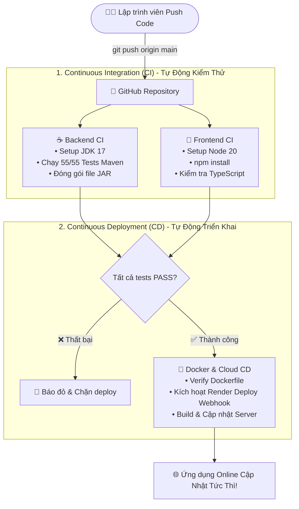

# Hướng Dẫn Thiết Lập Từng Bước CI/CD Với GitHub Actions 🚀

Dự án **ShareMoney** đã được tích hợp sẵn file cấu hình tự động hoá CI/CD chuẩn quốc tế tại [.github/workflows/ci-cd.yml](file:///c:/Users/DELL/Downloads/sharemoney/sharemoney/.github/workflows/ci-cd.yml).

Tài liệu này sẽ hướng dẫn bạn từng bước từ lúc đẩy code lên GitHub cho đến khi toàn bộ hệ thống tự động kiểm thử, đóng gói và triển khai lên Cloud mà không cần thao tác thủ công.

---

## 🧭 1. Mô Hình Hoạt Động Của Pipeline CI/CD



---

## 🛠️ 2. Các Bước Thực Hiện Chi Tiết

### Bước 1: Khởi Tạo Git & Đẩy Code Lên GitHub

Nếu dự án chưa liên kết với GitHub, bạn mở terminal và thực hiện:

```bash
# 1. Khởi tạo Git (nếu chưa có)
git init

# 2. Thêm toàn bộ file vào git
git add .

# 3. Tạo commit đầu tiên
git commit -m "feat: setup fullstack sharemoney with auto CI/CD pipeline"

# 4. Đổi tên nhánh chính thành main
git branch -M main

# 5. Liên kết với repository trên GitHub của bạn
# (Thay your-username/sharemoney bằng đường dẫn repo thật của bạn)
git remote add origin https://github.com/your-username/sharemoney.git

# 6. Đẩy mã nguồn lên GitHub
git push -u origin main
```

---

### Bước 2: Quan Sát Pipeline Chạy Tự Động Trên GitHub

1. Truy cập vào trang GitHub Repository của bạn trên trình duyệt (ví dụ: `https://github.com/your-username/sharemoney`).
2. Nhấp vào tab **Actions** trên thanh menu trên cùng.
3. Bạn sẽ thấy workflow **"ShareMoney CI/CD Pipeline"** đang tự động chạy:
   - ☕ **Backend CI**: Tự động tải JDK 17, chạy toàn bộ bộ kiểm thử Spring Boot (`BUILD SUCCESS`).
   - 📱 **Frontend CI**: Tự động cài đặt thư viện npm, rà soát lỗi TypeScript (`0 errors`).
   - 🚀 **Deploy CD**: Tự động kiểm thử Docker build sẵn sàng cho Cloud.
4. Khi cả 3 jobs hiện dấu tích xanh **`✔`**, mã nguồn của bạn được chứng nhận 100% ổn định và không có lỗi tiềm ẩn!

---

### Bước 3: Thiết Lập Tự Động Triển Khai (Auto-Deploy) Lên Render.com

Để mỗi khi bạn `git push` lên GitHub, server Backend trên Render tự động cập nhật phiên bản mới nhất:

1. **Lấy Webhook URL từ Render.com:**
   - Vào Dashboard [Render.com](https://render.com) $\rightarrow$ Nhấp vào Web Service Backend của bạn (`sharemoney-backend`).
   - Chọn mục **Settings** ở thanh bên trái.
   - Kéo xuống phần **Deploy Hook** $\rightarrow$ Bấm nút **Copy** (bạn sẽ có một đường link dạng `https://api.render.com/deploy/srv-xxxxxx?key=yyyyyy`).

2. **Thêm Secret vào GitHub Repository:**
   - Quay lại GitHub Repo $\rightarrow$ Vào mục **Settings** $\rightarrow$ **Secrets and variables** $\rightarrow$ **Actions**.
   - Bấm nút **New repository secret**.
   - **Name:** `RENDER_DEPLOY_HOOK`
   - **Secret:** Dán đường link Webhook URL vừa copy ở trên vào.
   - Bấm **Add secret**.

🎉 **Từ nay trở đi:** Mỗi khi bạn sửa code và gõ `git push origin main`, GitHub Actions sẽ tự động kiểm tra toàn bộ unit test, nếu pass 100% sẽ gửi tín hiệu kích hoạt Render tự động deploy server mới lên Internet mà bạn không cần phải bấm gì thêm!

---

### Bước 4: Tự Động Hoá Build File APK Mobile Khi Có Bản Cập Nhật Mới (EAS Build)

Nếu bạn muốn tạo file cài đặt Android `.apk` tự động qua lệnh:

1. Đăng ký tài khoản tại [https://expo.dev](https://expo.dev) (miễn phí).
2. Tạo Access Token tại: [https://expo.dev/settings/access-tokens](https://expo.dev/settings/access-tokens) $\rightarrow$ Bấm **Create Token** $\rightarrow$ Đặt tên `github-eas-token`.
3. Thêm Token này vào GitHub Secrets:
   - Vào GitHub Repo $\rightarrow$ **Settings** $\rightarrow$ **Secrets and variables** $\rightarrow$ **Actions** $\rightarrow$ **New repository secret**.
   - **Name:** `EXPO_TOKEN`
   - **Secret:** Dán mã Token Expo vào.
4. Khi cần sinh file APK mới, bạn chỉ cần chạy lệnh trên máy:
   ```bash
   cd FrontendReact
   npx eas-cli build -p android --profile preview
   ```
   Hoặc file APK sẽ được build trên Cloud của Expo và gửi thẳng link tải về máy của bạn!

---

## 🛡️ 3. Lợi Ích Của Pipeline CI/CD Này Khi Báo Cáo / Đồ Án

1. **Chuẩn Chỉ Đồ Án Kỹ Thuật Phần Mềm:** Có pipeline CI/CD tích hợp GitHub Actions thể hiện quy trình phát triển chuyên nghiệp, đáp ứng các tiêu chuẩn khắt khe của hội đồng bảo vệ.
2. **Bảo Vệ Hệ Thống (Zero Downtime / Zero Bug):** Nếu bạn vô tình viết sai cú pháp hoặc code làm hỏng logic, GitHub Actions sẽ phát hiện ngay trong bước CI và **tự động chặn deploy**, bảo vệ server online không bị sập.
3. **Tiết Kiệm Thời Gian:** Không cần đăng nhập thủ công vào server để kéo code hay build tay mỗi lần sửa lỗi.
