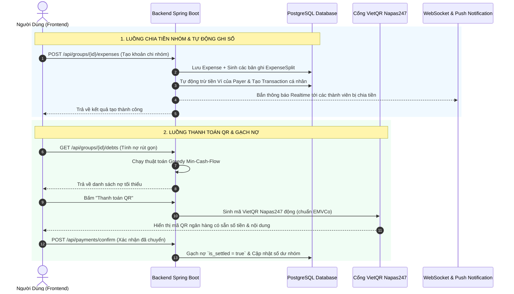

# 📚 BẢN THUYẾT MINH TOÀN BỘ CÔNG THỨC TOÁN HỌC & LUỒNG NGHIỆP VỤ (SHAREMONEY)
> **Dành cho sinh viên bảo vệ đồ án tốt nghiệp:** Toàn bộ thuật toán và công thức toán học trong code đã được **"dịch" 100% sang ngôn ngữ tự nhiên đời thường**, kèm ví dụ thực tế dễ hiểu và câu trả lời mẫu khi phản biện.

---

## MỤC LỤC
1. [Bảng Tra Cứu Nhanh Ký Hiệu Toán Học Sang Lời Văn](#1-bảng-tra-cứu-nhanh-ký-hiệu-toán-học-sang-lời-văn)
2. [Chi Tiết & Ví Dụ Đời Thực Từng Thuật Toán](#2-chi-tiết--ví-dụ-đời-thực-từng-thuật-toán)
   - [2.1. Hạn Mức An Toàn Để Tiêu Mỗi Ngày (Safe-to-Spend)](#21-hạn-mức-an-toàn-để-tiêu-mỗi-ngày-safe-to-spend)
   - [2.2. Thuật Toán Chia Tiền Đều & Xử Lý Lẻ Đồng (Equal Split)](#22-thuật-toán-chia-tiền-đều--xử-lý-lẻ-đồng-equal-split)
   - [2.3. Thuật Toán Rút Gọn Nợ Tối Thiểu (Greedy Min-Cash-Flow)](#23-thuật-toán-rút-gọn-nợ-tối-thiểu-greedy-min-cash-flow)
   - [2.4. Phát Hiện Chi Tiêu Bất Thường (Z-Score Anomaly Detection)](#24-phát-hiện-chi-tiêu-bất-thường-z-score-anomaly-detection)
   - [2.5. Điểm Sức Khỏe Tài Chính (Financial Health Score - 100đ)](#25-điểm-sức-khỏe-tài-chính-financial-health-score---100đ)
3. [Tổng Hợp Các Luồng Nghiệp Vụ Chính (Workflows)](#3-tổng-hợp-các-luồng-nghiệp-vụ-chính-workflows)
4. [Cẩm Nang Trả Lời Câu Hỏi Phản Biện Của Hội Đồng Thầy Cô](#4-cẩm-nang-trả-lời-câu-hỏi-phản-biện-của-hội-đồng-thầy-cô)

---

# 1. BẢNG TRA CỨU NHANH KÝ HIỆU TOÁN HỌC SANG LỜI VĂN

| Ký hiệu toán học | Tên gọi chuyên môn | Dịch sang ngôn ngữ đời thường | Ý nghĩa thực tế trong App |
| :--- | :--- | :--- | :--- |
| $\sum$ | Ký hiệu Sigma (Tổng) | **"Tổng cộng tất cả các khoản..."** | Cộng dồn tất cả các khoản tiền lại với nhau. |
| $\max(A, B)$ | Hàm Maximum | **"Lấy số lớn hơn giữa A và B"** | So sánh 2 số, số nào to hơn thì lấy số đó. |
| $\min(A, B)$ | Hàm Minimum | **"Lấy số nhỏ hơn giữa A và B"** | So sánh 2 số, số nào bé hơn thì lấy số đó. |
| $\lfloor X \rfloor$ | Hàm Floor (Lấy sàn) | **"Lấy phần nguyên, bỏ số lẻ"** | Ví dụ: $\lfloor 33.333,33 \rfloor = 33.333$ (bỏ phần đuôi lẻ sau dấu phẩy). |
| $\mu$ (Mu) | Mean (Giá trị trung bình) | **"Mức chi tiêu trung bình mỗi lần"** | Lấy tổng tiền đã tiêu chia cho số lần đi tiêu. |
| $\sigma$ (Sigma nhỏ) | Standard Deviation | **"Độ lệch chuẩn (Mức độ trồi sụt)"** | Đo xem thói quen tiêu tiền của bạn có ổn định hay lúc tiêu 20k lúc tiêu 5 triệu. |
| $Z$ | Z-Score | **"Thước đo mức độ bất thường"** | Đo xem lần tiêu tiền này có "bất thường/lố" gấp mấy lần so với bình thường. |
| $\arg\max / \arg\min$ | Argument of Max/Min | **"Người có giá trị lớn nhất / nhỏ nhất"** | Chỉ ra ai là người đang được nợ nhiều nhất hoặc nợ nhiều nhất. |

---

# 2. CHI TIẾT & VÍ DỤ ĐỜI THỰC TỪNG THUẬT TOÁN

---

## 2.1. Hạn Mức An Toàn Để Tiêu Mỗi Ngày (Safe-to-Spend)

### 📌 Công thức trong code:
$$\text{TotalBills} = \sum_{b \in \text{MandatoryBudgets}} \max(\text{LimitAmount}_b, \text{SpentAmount}_b)$$
$$\text{SafeBalance}_{\text{Total}} = \max\left(0, \text{TotalIncome} - \text{TotalBills} - \text{FlexibleSpent}\right)$$
$$\text{SafeBalance}_{\text{Daily}} = \frac{\text{SafeBalance}_{\text{Total}}}{\text{DaysLeftInMonth}}$$

### 🗣️ Dịch sang ngôn ngữ tự nhiên:
1. **Tiền hóa đơn bắt buộc (`TotalBills`):**
   * Với mỗi hóa đơn cố định trong tháng (như tiền phòng trọ, tiền điện, tiền trả góp): Bạn phải **giữ lại ít nhất bằng số tiền dự tính**.
   * Nhưng nếu thực tế hóa đơn đó lỡ **vượt quá dự tính** (ví dụ tháng nóng bật điều hòa nhiều làm tiền điện tăng), hệ thống sẽ **lấy số tiền thực tế lớn hơn đó** để bạn không bị thiếu tiền khi thanh toán!
2. **Số tiền an toàn còn lại trong tháng (`SafeBalance_Total`):**
   * Lấy **Tổng thu nhập tháng** trừ đi **Toàn bộ tiền hóa đơn bắt buộc** và trừ đi **Các khoản ăn uống/mua sắm linh hoạt đã tiêu**.
3. **Số tiền an toàn mỗi ngày (`SafeBalance_Daily`):**
   * Lấy số tiền an toàn còn lại chia đều cho **số ngày còn lại từ hôm nay đến hết tháng**.

### 💡 Ví dụ đời thực:
* Bạn có lương tháng **10.000.000 đ**.
* Bạn có 2 hóa đơn bắt buộc:
  * Tiền phòng trọ: Hạn mức dự tính 3.000.000 đ (chưa đóng). $\to \max(3tr, 0) = 3.000.000$ đ.
  * Tiền điện: Hạn mức dự tính 500.000 đ, nhưng thực tế hóa đơn báo về 600.000 đ $\to \max(500k, 600k) = 600.000$ đ.
  * $\to \text{TotalBills} = 3.000.000 + 600.000 = \mathbf{3.600.000}$ đ.
* Từ đầu tháng đến nay, bạn đã đi uống trà sữa, mua sắm linh hoạt hết **2.000.000 đ** (`FlexibleSpent`).
* 👉 **Số tiền an toàn còn lại:** $10.000.000 - 3.600.000 - 2.000.000 = \mathbf{4.400.000}$ đ.
* Tháng này còn **22 ngày nữa** mới hết tháng:
* 👉 **Hôm nay bạn được tiêu tối đa:** $\frac{4.400.000}{22} = \mathbf{200.000}$ đ/ngày.
*(Nếu hôm nay bạn tiêu dưới 200k, bạn hoàn toàn yên tâm cuối tháng vẫn đủ tiền trả tiền phòng và tiền điện không bao giờ bị âm ví!)*

---

## 2.2. Thuật Toán Chia Tiền Đều & Xử Lý Lẻ Đồng (Equal Split)

### 📌 Công thức trong code:
$$\text{Base} = \left\lfloor \frac{\text{Total}}{N} \right\rfloor$$
$$\text{Remainder} = \text{Total} - (\text{Base} \times N)$$
$$\text{Amount}_i = \begin{cases} \text{Base} + \text{Remainder} & \text{với người thứ nhất } (i = 0) \\ \text{Base} & \text{với các người còn lại } (i > 0) \end{cases}$$

### 🗣️ Dịch sang ngôn ngữ tự nhiên:
* Khi cả nhóm đi ăn hết một số tiền không chia hết (ví dụ: 100.000 đ chia cho 3 người $\to 33.333,333...$ đ).
* Hệ thống sẽ **bỏ số thập phân**, lấy tròn phần nguyên là 33.333 đ cho mỗi người.
* Khi nhân 33.333 đ $\times$ 3 người thì mới được 99.999 đ (còn **thiếu 1 đồng lẻ**).
* Hệ thống tự động **cộng 1 đồng lẻ này vào người đầu tiên** (người đầu tiên trả 33.334 đ, 2 người sau trả 33.333 đ).
* **Kết quả:** Tổng số tiền của các thành viên luôn khớp chính xác 100% với hóa đơn gốc, không bao giờ bị lệch dù chỉ 1 đồng.

---

## 2.3. Thuật Toán Rút Gọn Nợ Tối Thiểu (Greedy Min-Cash-Flow)

### 📌 Vấn đề thực tế:
Trong một chuyến du lịch, 4 người bạn A, B, C, D chi tiêu nợ chéo nhau:
* A trả tiền ăn sáng cho B: 100k
* B trả tiền cafe cho C: 100k
* C trả tiền vé xe cho A: 50k
* D trả tiền nước cho B: 50k
$\to$ Nếu để từng người tự chuyển khoản qua lại thì nhóm phải thực hiện **4 - 6 giao dịch chuyển tiền**, rất rối rắm và tốn phí giao dịch!

### 🗣️ Cách giải quyết của thuật toán:

#### Bước 1: Tính "Số dư ròng" (Sau tất cả, ai đang DƯ tiền và ai đang THIẾU tiền)
* **Số dư ròng** = (Tổng tiền mình đã bỏ ra trả hộ người khác) - (Tổng tiền người khác đã trả hộ mình).
  * Nếu số dư **DƯƠNG (+)**: Bạn là **Chủ nợ** (bạn cần nhận về tiền).
  * Nếu số dư **ÂM (-)**: Bạn là **Con nợ** (bạn cần bỏ tiền túi ra trả).
  * Tổng số tiền dư của tất cả chủ nợ luôn bằng đúng tổng số tiền thiếu của tất cả con nợ.

#### Bước 2: Ghép đôi thanh toán Tham lam (Greedy)
1. Chọn người **đang thiếu nhiều tiền nhất** trong nhóm (Max Debtor).
2. Chọn người **đang cần nhận lại nhiều tiền nhất** trong nhóm (Max Creditor).
3. Cho người thiếu tiền chuyển khoản thẳng một lần cho người cần nhận tiền với số tiền = $\min(\text{tiền nợ}, \text{tiền cần nhận})$.
4. Gạch nợ cho người đã trả xong, lặp lại bước 1 cho đến khi tất cả mọi người đều về 0đ.

### 💡 Ví dụ rút gọn:
* A: chi 100k (cho B) - nhận 50k (từ C) $\to$ **Dư +50k**
* B: nhận 100k (từ A) - chi 100k (cho C) + nhận 50k (từ D) $\to$ **Nợ -50k**
* C: nhận 100k (từ B) - chi 50k (cho A) $\to$ **Nợ -50k** (sau khi bù trừ C nợ B 50k)
* D: chi 50k (cho B) $\to$ **Dư +50k**
* 👉 **Thuật toán chỉ cần tạo 2 giao dịch trực tiếp:**
  1. **B** chuyển cho **A**: 50.000 đ (B và A xong nợ).
  2. **C** chuyển cho **D**: 50.000 đ (C và D xong nợ).
$\to$ Toàn bộ nhóm sạch nợ chỉ với đúng **2 lần chuyển khoản** thay vì 4 lần nợ chéo!

---

## 2.4. Phát Hiện Chi Tiêu Bất Thường (Z-Score Anomaly Detection)

### 📌 Công thức trong code:
$$\mu = \frac{1}{k} \sum_{i=1}^k X_i \quad (\text{Trung bình})$$
$$\sigma = \sqrt{\frac{1}{k} \sum_{i=1}^k (X_i - \mu)^2} \quad (\text{Độ lệch chuẩn})$$
$$Z = \frac{X_{\text{mới}} - \mu}{\sigma}$$

### 🗣️ Dịch sang ngôn ngữ tự nhiên:
* Khi bạn nhập một khoản chi tiêu mới (ví dụ: bữa ăn trưa), hệ thống sẽ nhìn lại **lịch sử chi tiêu ăn uống của bạn trong 90 ngày qua**.
* **$\mu$ (Trung bình):** Bình thường mỗi bữa ăn bạn tiêu khoảng 40.000 đ.
* **$\sigma$ (Độ lệch chuẩn):** Mức độ dao động thông thường của bạn là từ 30.000 đ đến 50.000 đ (dao động khoảng 10.000 đ).
* **$Z$-Score (Độ bất thường):** Hôm nay bạn đi ăn liên hoan hết **300.000 đ** ($X_{\text{mới}}$).
  $$Z = \frac{300.000 - 40.000}{10.000} = \frac{260.000}{10.000} = \mathbf{26.0}$$
* **Đánh giá:** Vì $Z = 26.0 > 2.0$ (vượt xa ngưỡng bình thường), hệ thống nhận diện ngay đây là khoản chi **đột biến bất thường** và tự động gửi thông báo:
  > *"⚠️ Cảnh báo chi tiêu: Khoản ăn uống 300.000đ cao hơn rất nhiều so với mức trung bình 40.000đ của bạn. Hãy chú ý để không vượt ngân sách tháng!"*

---

## 2.5. Điểm Sức Khỏe Tài Chính (Financial Health Score - 100đ)

Hệ thống đánh giá tình trạng "sức khỏe ví tiền" của bạn qua 4 tiêu chí chuẩn quốc tế (mỗi tiêu chí 25 điểm, tổng điểm 100):

### 1. Điểm Tỷ lệ Tiết kiệm (25 điểm)
* **Ý nghĩa:** Tháng này bạn giữ lại được bao nhiêu % từ tiền lương kiếm được?
* **Cách tính:** $\text{Tỷ lệ} = \frac{\text{Thu nhập} - \text{Chi tiêu}}{\text{Thu nhập}} \times 100\%$
  * Tiết kiệm $\ge 20\%$ thu nhập $\to$ **Đạt 25/25 điểm** (Xuất sắc)
  * Tiết kiệm $\ge 10\%$ thu nhập $\to$ **Đạt 15/25 điểm** (Khá)
  * Tiết kiệm $> 0\%$ thu nhập $\to$ **Đạt 5/25 điểm** (Đủ sống)
  * Chi tiêu âm vào lương $\to$ **0 điểm**

### 2. Điểm Kiểm soát Chi tiêu (25 điểm - Quy tắc 50/30/20)
* **Ý nghĩa:** Bạn tiêu bao nhiêu % thu nhập cho sinh hoạt?
* **Cách tính:** $\text{Tỷ lệ} = \frac{\text{Chi tiêu}}{\text{Thu nhập}} \times 100\%$
  * Chi tiêu $\le 50\%$ thu nhập $\to$ **Đạt 25/25 điểm**
  * Chi tiêu $\le 80\%$ thu nhập $\to$ **Đạt 15/25 điểm**
  * Tiêu hết từ 80% - 100% $\to$ **Đạt 5/25 điểm**

### 3. Điểm Quỹ Dự Phòng Khẩn Cấp (25 điểm)
* **Ý nghĩa:** Bạn có đủ tiền dự phòng cho lúc ốm đau, sự cố bất ngờ không?
* Tích lũy dự phòng $\ge 15\%$ thu nhập mỗi tháng $\to$ **25 điểm**.

### 4. Điểm Quản Lý Nợ - DTI (25 điểm)
* **Ý nghĩa:** Khoản nợ bạn phải trả chiếm bao nhiêu % thu nhập?
* **Cách tính:** $\text{Tỷ lệ nợ} = \frac{\text{Tổng nợ cần trả}}{\text{Thu nhập}} \times 100\%$
  * Nợ $\le 10\%$ thu nhập $\to$ **Đạt 25/25 điểm** (Nợ an toàn)
  * Nợ $\le 30\%$ thu nhập $\to$ **Đạt 15/25 điểm** (Nợ trung bình)
  * Nợ $\le 50\%$ thu nhập $\to$ **Đạt 5/25 điểm** (Cảnh báo nợ cao)
  * Nợ $> 50\%$ thu nhập $\to$ **0 điểm** (Nguy cơ vỡ nợ)

---

# 3. TỔNG HỢP CÁC LUỒNG NGHIỆP VỤ CHÍNH (WORKFLOWS)

---

# 4. CẨM NANG TRẢ LỜI CÂU HỎI PHẢN BIỆN CỦA HỘI ĐỒNG THẦY CÔ

### ❓ Câu 1: Tại sao em lại chọn thuật toán Greedy (Tham lam) để rút gọn nợ nhóm mà không dùng thuật toán khác?
* **Trả lời mẫu:**
  > *"Thưa thầy/cô, bài toán rút gọn nợ nhóm bản chất là bài toán Min-Cash-Flow (luồng tiền cực tiểu) trên đồ thị có hướng. Trong trường hợp tổng quát, bài toán tìm số giao dịch tối ưu tuyệt đối là bài toán NP-Hard (chứng minh qua bài toán Subset Sum). Thuật toán Greedy (Tham lam) ghép cặp giữa người nợ nhiều nhất và người được nợ nhiều nhất có độ phức tạp chỉ $O(N \log N)$ (với $N$ là số thành viên), luôn đảm bảo giải quyết xong toàn bộ nợ trong tối đa $N-1$ giao dịch. Đây là giải thuật tối ưu nhất về mặt hiệu năng thực tế, được các ứng dụng hàng đầu thế giới như Splitwise áp dụng."*

### ❓ Câu 2: Trong công thức Safe-to-Spend, tại sao lại dùng hàm `max(LimitAmount, SpentAmount)` cho các khoản chi bắt buộc?
* **Trả lời mẫu:**
  > *"Thưa thầy/cô, đối với các khoản chi cố định như tiền điện hay tiền phòng trọ: Nếu chưa đến ngày thanh toán (thực chi = 0), hệ thống phải giữ lại số tiền hạn mức dự trù. Nhưng nếu hóa đơn thực tế phát sinh cao hơn dự trù (ví dụ tiền điện vọt lên 600k thay vì 500k), hệ thống dùng hàm `max()` để lập tức giữ lại đúng 600k. Điều này đảm bảo người dùng không bao giờ bị 'chi tiêu hớ' sang khoản tiền sinh hoạt khác dẫn đến thiếu tiền trả hóa đơn."*

### ❓ Câu 3: Thuật toán Z-Score phát hiện chi tiêu bất thường hoạt động như thế nào và có ưu điểm gì?
* **Trả lời mẫu:**
  > *"Thưa thầy/cô, Z-Score là thuật toán thống kê chuẩn hóa. Thay vì đặt một con số cố định (ví dụ chi trên 500k là báo động - điều này không đúng với người giàu hoặc người có thu nhập cao), Z-Score cá nhân hóa theo từng người dùng và từng danh mục. Nó tính giá trị trung bình $\mu$ và độ lệch chuẩn $\sigma$ trong 90 ngày của chính người dùng đó. Khi $Z > 2.0$, tức là khoản chi đó nằm ngoài vùng 97.7% các khoản chi thông thường, hệ thống mới đưa ra cảnh báo để tránh spam thông báo rác."*

---
*Tài liệu được tạo tự động bởi hệ thống ShareMoney - Lưu tại thư mục gốc của dự án: `TAI_LIEU_THUAT_TOAN_VA_LUONG_NGHIEP_VU.md`.*
