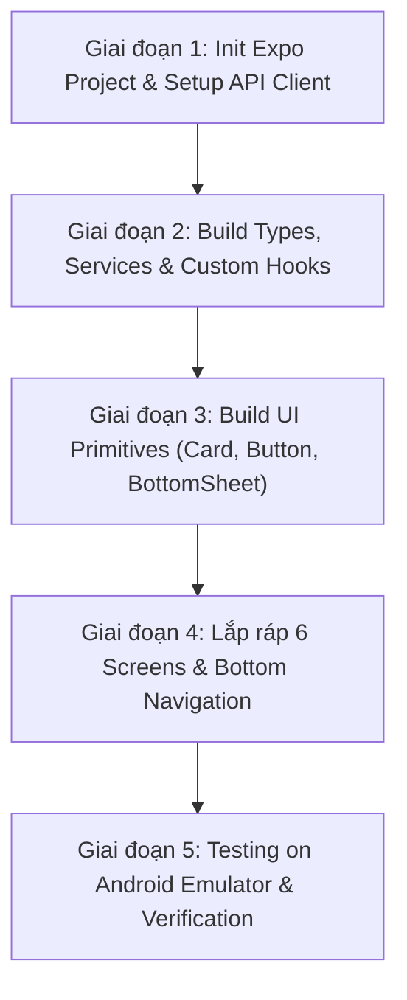

# 📘 DỰ THẢO MASTER SPECIFICATION & KẾ HOẠCH CHI TIẾT CHUYỂN ĐỔI FRONTEND SANG REACT NATIVE (SHAREMONEY MOBILE APP)

> **Mục tiêu:** Chuyển đổi toàn bộ giao diện và tính năng Frontend từ Next.js Web sang ứng dụng di động thuần **React Native (Expo TypeScript)** theo chuẩn **Clean Architecture & SOLID Principles**.
> 
> **Cam kết hệ thống:** Giữ nguyên 100% mã nguồn **Backend Java Spring Boot 3, REST APIs, PostgreSQL DB và 43/43 Automated Unit Tests**.

---

## 📋 MỤC LỤC CHI TIẾT
1. [Bản Đồ Kiến Trúc Hệ Thống & Cấu Trúc Thư Mục Clean Architecture](#1-bản-đồ-kiến-trúc-hệ-thống--cấu-trúc-thư-mục-clean-architecture)
2. [Danh Sách Chi Tiết 100% Rest API Endpoints Kết Nối Backend](#2-danh-sách-chi-tiết-100-rest-api-endpoints-kết-nối-backend)
3. [Chi Tiết Tầng Types & Interfaces (`src/types/`)](#3-chi-tiết-tầng-types--interfaces-srctypes)
4. [Chi Tiết Tầng Services (`src/services/`)](#4-chi-tiết-tầng-services-srcservices)
5. [Chi Tiết Tầng Custom Hooks & Financial State Management (`src/hooks/`)](#5-chi-tiết-tầng-custom-hooks--financial-state-management-srchooks)
6. [Chi Tiết Bộ UI Components Tái Sử Dụng (`src/components/ui/`)](#6-chi-tiết-bộ-ui-components-tái-sử-dụng-srccomponentsui)
7. [Chi Tiết 6 Màn Hình Chính (`src/screens/`)](#7-chi-tiết-6-màn-hình-chính-srcscreens)
8. [Chi Tiết Các Bottom Sheet Di Động (`src/components/modals/`)](#8-chi-tiết-các-bottom-sheet-di-động-srccomponentsmodals)
9. [Lộ Trình Triển Khai 5 Giai Đoạn Chi Tiết](#9-lộ-trình-triển-khai-5-giai-đoạn-chi-tiết)
10. [Kế Hoạch Kiểm Thử & Nghiệm Thu (Testing & QA)](#10-kế-hoạch-kiểm-thử--nghiệm-thu-testing--qa)

---

## 1. BẢN ĐỒ KIẾN TRÚC HỆ THỐNG & CẤU TRÚC THƯ MỤC CLEAN ARCHITECTURE

Dự án mới sẽ được khởi tạo tại thư mục `ShareMoneyMobile` (`c:\Users\DELL\Downloads\sharemoney\sharemoney\ShareMoneyMobile`).

```
ShareMoneyMobile/
├── App.tsx                        # Root Entry Point (Chứa Providers & Navigation)
├── app.json                       # Cấu hình Expo App (Icon, Splash, Orientation, Permissions)
├── package.json                   # Dependencies
├── tsconfig.json                  # Strict TypeScript Config
└── src/
    ├── types/                     # 1. TypeScript Types (Đồng bộ 1:1 DTO Backend)
    │   ├── index.ts               # Barrel Export
    │   ├── auth.ts                # Login, Register, UserSummary
    │   ├── wallet.ts              # Wallet, WalletPayload
    │   ├── budget.ts              # Budget, BudgetSummary
    │   ├── savings.ts             # SavingsGoal, AutoAllocateResponse
    │   ├── transaction.ts         # Transaction, CategoryBreakdown
    │   └── group.ts               # Group, GroupExpense, DebtSummary
    │
    ├── constants/                 # 2. Design System Tokens & App Constants
    │   ├── colors.ts              # Bảng màu Modern Fintech HSL (Indigo, Emerald, Rose, Amber)
    │   ├── typography.ts          # Roboto Font weights & font sizes
    │   └── banks.ts               # Danh sách 9+ Ngân hàng VietQR Napas247
    │
    ├── services/                  # 3. Services Layer (API Transport)
    │   ├── api.ts                 # Axios Base Client (Dynamic IP 10.0.2.2 & Bearer Token)
    │   ├── authService.ts         # AuthService API calls
    │   ├── walletService.ts       # WalletService API calls
    │   ├── budgetService.ts       # BudgetService API calls
    │   ├── savingsService.ts      # SavingsGoalService API calls
    │   ├── transactionService.ts  # TransactionService API calls
    │   └── groupService.ts        # GroupService API calls
    │
    ├── hooks/                     # 4. Custom Hooks (Logic & State Layer)
    │   ├── useAuth.ts             # Auth State, Login, Logout, Token Storage
    │   ├── useAppData.ts          # Single Source of Truth cho ví, nợ, số dư
    │   └── useSavings.ts          # Safety Reserve Floor calculation & Auto-allocate
    │
    ├── components/                # 5. Component Layer
    │   ├── ui/                    # Reusable UI Primitives (Atoms)
    │   │   ├── Card.tsx           # Thẻ container bo góc rounded-3xl bg-white
    │   │   ├── Button.tsx         # Pressable spring physics button
    │   │   ├── Badge.tsx          # Priority & status badges
    │   │   ├── ProgressBar.tsx    # Animated progress bar
    │   │   ├── Input.tsx          # Styled TextInput
    │   │   └── BottomSheet.tsx    # Slide-up modal container
    │   │
    │   └── features/              # Complex Domain Components
    │       ├── SavingsGoalCard.tsx
    │       ├── FinancialSummaryCard.tsx
    │       ├── VietQRCard.tsx
    │       └── GroupDebtCard.tsx
    │
    ├── screens/                   # 6. Screen Containers (Views)
    │   ├── AuthScreen.tsx         # Welcome, Login, Register
    │   ├── DashboardScreen.tsx    # Wallet overview, Quick actions, Top 5
    │   ├── SavingsScreen.tsx      # AI Savings, Safety reserve, Goal list
    │   ├── ReportScreen.tsx       # 50/30/20 breakdown, 5 Summary cards
    │   ├── GroupsScreen.tsx       # Group list, Split bill, VietQR settlement
    │   └── ProfileScreen.tsx      # User info, Bank link, Logout
    │
    └── navigation/                # 7. Navigation Management
        ├── AppNavigator.tsx       # Main Stack & Auth Guard
        └── BottomTabNavigator.tsx # Custom Bottom Tab Bar
```

---

## 2. DANH SÁCH CHI TIẾT 100% REST API ENDPOINTS KẾT NỐI BACKEND

Toàn bộ các yêu cầu HTTP đều đính kèm Header `Authorization: Bearer <JWT_TOKEN>` (ngoại trừ Auth Endpoints):

| STT | Endpoint | Method | Chức năng | Request Body / Params | Response DTO |
| :---: | :--- | :---: | :--- | :--- | :--- |
| **1** | `/api/auth/login` | `POST` | Đăng nhập tài khoản | `{ email, password }` | `{ token, user: UserSummary }` |
| **2** | `/api/auth/register` | `POST` | Đăng ký tài khoản | `{ name, email, password }` | `{ token, user: UserSummary }` |
| **3** | `/api/wallets` | `GET` | Lấy danh sách ví | None | `Wallet[]` |
| **4** | `/api/wallets` | `POST` | Tạo ví mới | `{ name, balance, bankBin, bankAccountNo }` | `Wallet` |
| **5** | `/api/wallets/{id}` | `PUT` | Cập nhật thông tin ví | `{ name, balance, bankBin, bankAccountNo }` | `Wallet` |
| **6** | `/api/wallets/{id}` | `DELETE` | Xóa ví | None | `void` |
| **7** | `/api/budgets/summary` | `GET` | Tóm tắt ngân sách tháng | `?year=2026&month=8` | `BudgetSummary[]` |
| **8** | `/api/budgets` | `POST` | Thêm ngân sách | `{ categoryId, limitAmount, month, year, type }` | `Budget` |
| **9** | `/api/savings-goals` | `GET` | Lấy mục tiêu tiết kiệm | None | `SavingsGoal[]` |
| **10** | `/api/savings-goals` | `POST` | Tạo mục tiêu tiết kiệm | `{ name, targetAmount, targetDate, priority, monthlyContribution }` | `SavingsGoal` |
| **11** | `/api/savings-goals/auto-allocate` | `POST` | **Phân bổ tiết kiệm nguyên tử** | None | `AutoAllocateResponse` |
| **12** | `/api/savings-goals/{id}/deposit` | `POST` | Nạp tiền thủ công | `{ amount }` | `SavingsGoal` |
| **13** | `/api/transactions/summary/monthly` | `GET` | Tổng quan thu chi tháng | `?year=2026&month=8` | `MonthlySummary` |
| **14** | `/api/transactions/summary/category` | `GET` | Phân tích chi tiêu 50/30/20 | `?year=2026&month=8` | `CategoryBreakdown[]` |
| **15** | `/api/transactions/summary/income-category` | `GET` | Phân tích danh mục thu | `?year=2026&month=8` | `CategoryBreakdown[]` |
| **16** | `/api/transactions/monthly` | `GET` | Danh sách giao dịch tháng | `?year=2026&month=8` | `Transaction[]` |
| **17** | `/api/transactions` | `POST` | Thêm giao dịch mới | `{ walletId, categoryId, amount, type, note, transactionDate }` | `Transaction` |
| **18** | `/api/groups` | `GET` | Lấy danh sách nhóm | None | `Group[]` |
| **19** | `/api/groups` | `POST` | Tạo nhóm mới | `{ name, description }` | `Group` |
| **20** | `/api/groups/{id}/expenses` | `GET` | Lấy chi tiêu nhóm | `?page=0&size=20` | `Page<GroupExpense>` |
| **21** | `/api/groups/{id}/expenses` | `POST` | Thêm chi tiêu nhóm | `{ title, amount, payerId, splitMemberIds }` | `GroupExpense` |
| **22** | `/api/groups/debts/summary` | `GET` | Tóm tắt nợ ròng nhóm | None | `{ totalOwing, totalOwed, details }` |
| **23** | `/api/users/me/phone` | `PUT` | Cập nhật số điện thoại | `{ phone }` | `UserSummary` |
| **24** | `/api/users/me/profile` | `PUT` | Cập nhật liên kết VietQR | `{ name, bankBin, bankAccountNo }` | `UserSummary` |

---

## 3. CHI TIẾT TẦNG TYPES & INTERFACES (`src/types/`)

### `src/types/auth.ts`
```typescript
export interface UserSummary {
  id: string;
  email: string;
  name: string;
  phone?: string;
  avatarUrl?: string;
  bankBin?: string;
  bankAccountNo?: string;
  bankAccountName?: string;
  bankQrUrl?: string;
}

export interface AuthResponse {
  token: string;
  user: UserSummary;
}
```

### `src/types/wallet.ts`
```typescript
export interface Wallet {
  id: string;
  name: string;
  balance: number;
  currency: string;
  isLiability: boolean;
  bankBin?: string;
  bankAccountNo?: string;
  bankAccountName?: string;
}
```

### `src/types/savings.ts`
```typescript
export type SavingsPriority = "URGENT" | "HIGH" | "MEDIUM" | "LOW";

export interface SavingsGoal {
  id: string;
  name: string;
  targetAmount: number;
  currentAmount: number;
  targetDate: string;
  priority: SavingsPriority;
  monthlyContribution: number;
}

export interface AutoAllocateResponse {
  allocatedTotal: number;
  remainingSafeBalance: number;
  allocatedGoals: Array<{ goalName: string; amount: number }>;
}
```

---

## 4. CHI TIẾT TẦNG SERVICES (`src/services/`)

### `src/services/api.ts`
```typescript
import axios from "axios";
import AsyncStorage from "@react-native-async-storage/async-storage";
import { Platform } from "react-native";

const getBaseUrl = () => {
  if (Platform.OS === "android") {
    return "http://10.0.2.2:8080/api";
  }
  return "http://localhost:8080/api";
};

export const api = axios.create({
  baseURL: getBaseUrl(),
  headers: { "Content-Type": "application/json" },
});

api.interceptors.request.use(async (config) => {
  const token = await AsyncStorage.getItem("token");
  if (token) {
    config.headers.Authorization = `Bearer ${token}`;
  }
  return config;
});
```

### `src/services/financialServices.ts`
```typescript
import { api } from "./api";
import { Wallet, SavingsGoal, AutoAllocateResponse, BudgetSummary, MonthlySummary, CategoryBreakdown } from "../types";

export const financialServices = {
  // Wallets
  getWallets: () => api.get<Wallet[]>("/wallets").then((res) => res.data),
  createWallet: (data: Partial<Wallet>) => api.post<Wallet>("/wallets", data).then((res) => res.data),
  
  // Savings Goals & Safety Reserve Auto-allocation
  getSavingsGoals: () => api.get<SavingsGoal[]>("/savings-goals").then((res) => res.data),
  autoAllocateSavings: () => api.post<AutoAllocateResponse>("/savings-goals/auto-allocate").then((res) => res.data),
  
  // Budgets & Analytics
  getBudgetSummary: (year: number, month: number) => 
    api.get<BudgetSummary[]>(`/budgets/summary?year=${year}&month=${month}`).then((res) => res.data),
  getCategoryBreakdown: (year: number, month: number) => 
    api.get<CategoryBreakdown[]>(`/transactions/summary/category?year=${year}&month=${month}`).then((res) => res.data),
  getMonthlySummary: (year: number, month: number) => 
    api.get<MonthlySummary>(`/transactions/summary/monthly?year=${year}&month=${month}`).then((res) => res.data),
};
```

---

## 5. CHI TIẾT TẦNG CUSTOM HOOKS & FINANCIAL STATE MANAGEMENT (`src/hooks/`)

### `src/hooks/useAppData.ts`
```typescript
import { useState, useEffect, useCallback } from "react";
import { financialServices } from "../services/financialServices";
import { Wallet, BudgetSummary } from "../types";

export function useAppData() {
  const [wallets, setWallets] = useState<Wallet[]>([]);
  const [budgets, setBudgets] = useState<BudgetSummary[]>([]);
  const [isLoading, setIsLoading] = useState(true);
  const [refreshTrigger, setRefreshTrigger] = useState(0);

  const fetchData = useCallback(async () => {
    setIsLoading(true);
    try {
      const now = new Date();
      const [walletData, budgetData] = await Promise.all([
        financialServices.getWallets(),
        financialServices.getBudgetSummary(now.getFullYear(), now.getMonth() + 1),
      ]);
      setWallets(walletData);
      setBudgets(budgetData);
    } catch (e) {
      console.error("Failed to fetch app data", e);
    } finally {
      setIsLoading(false);
    }
  }, []);

  useEffect(() => {
    fetchData();
  }, [fetchData, refreshTrigger]);

  const refresh = () => setRefreshTrigger((prev) => prev + 1);

  const totalWalletBalance = wallets.reduce((sum, w) => sum + (w.isLiability ? 0 : w.balance), 0);

  return { wallets, budgets, totalWalletBalance, isLoading, refresh };
}
```

### `src/hooks/useSavings.ts`
```typescript
import { useState, useEffect, useCallback } from "react";
import { financialServices } from "../services/financialServices";
import { SavingsGoal } from "../types";

export function useSavings(walletBalance: number, unpaidBudgetsTotal: number, totalOwing: number) {
  const [goals, setGoals] = useState<SavingsGoal[]>([]);
  const [isAllocating, setIsAllocating] = useState(false);

  const requiredReserve = unpaidBudgetsTotal + totalOwing;
  const safeToSpend = Math.max(0, walletBalance - requiredReserve);
  const isSafetyFloorReached = safeToSpend <= 0;

  const fetchGoals = useCallback(async () => {
    const data = await financialServices.getSavingsGoals();
    setGoals(data);
  }, []);

  useEffect(() => {
    fetchGoals();
  }, [fetchGoals]);

  const autoAllocate = async () => {
    if (isSafetyFloorReached) throw new Error("SAFETY_RESERVE_VIOLATION");
    setIsAllocating(true);
    try {
      const res = await financialServices.autoAllocateSavings();
      await fetchGoals();
      return res;
    } finally {
      setIsAllocating(false);
    }
  };

  return { goals, requiredReserve, safeToSpend, isSafetyFloorReached, autoAllocate, isAllocating, refreshGoals: fetchGoals };
}
```

---

## 6. CHI TIẾT BỘ UI COMPONENTS TÁI SỬ DỤNG (`src/components/ui/`)

### `src/components/ui/Card.tsx`
```tsx
import React from "react";
import { View, StyleSheet, ViewStyle } from "react-native";
import { colors } from "../../constants/colors";

interface CardProps {
  children: React.ReactNode;
  style?: ViewStyle;
}

export const Card: React.FC<CardProps> = ({ children, style }) => {
  return <View style={[styles.card, style]}>{children}</View>;
};

const styles = StyleSheet.create({
  card: {
    backgroundColor: colors.white,
    borderRadius: 24,
    padding: 20,
    borderWidth: 1,
    borderColor: colors.slate100,
    shadowColor: "#000",
    shadowOffset: { width: 0, height: 4 },
    shadowOpacity: 0.04,
    shadowRadius: 12,
    elevation: 2,
  },
});
```

### `src/components/ui/Button.tsx`
```tsx
import React from "react";
import { Pressable, Text, StyleSheet, ViewStyle, TextStyle } from "react-native";
import { colors } from "../../constants/colors";

interface ButtonProps {
  title: string;
  onPress: () => void;
  variant?: "primary" | "secondary" | "danger";
  disabled?: boolean;
}

export const Button: React.FC<ButtonProps> = ({ title, onPress, variant = "primary", disabled }) => {
  return (
    <Pressable
      onPress={onPress}
      disabled={disabled}
      style={({ pressed }) => [
        styles.button,
        styles[variant],
        disabled && styles.disabled,
        pressed && styles.pressed,
      ]}
    >
      <Text style={styles.text}>{title}</Text>
    </Pressable>
  );
};

const styles = StyleSheet.create({
  button: {
    paddingVertical: 14,
    paddingHorizontal: 20,
    borderRadius: 18,
    alignItems: "center",
    justifyContent: "center",
  },
  primary: { backgroundColor: colors.emerald600 },
  secondary: { backgroundColor: colors.slate100 },
  danger: { backgroundColor: colors.rose500 },
  disabled: { opacity: 0.5 },
  pressed: { transform: [{ scale: 0.97 }] },
  text: { color: colors.white, fontSize: 14, fontWeight: "800" },
});
```

---

## 7. CHI TIẾT 6 MÀN HÌNH CHÍNH (`src/screens/`)

### `DashboardScreen.tsx`
- **Tầng ghép nối UI Primitive**: Dùng `Card`, `Button`, `ProgressBar`, `useAppData`.
- **Hiển thị**: Số dư tổng khả dụng, 5 Nút thao tác nhanh (Thêm thu nhập, Ngân sách, Nhóm, Tiết kiệm, Lịch sử), Bảng xếp hạng Top 5 chi tiêu nhiều nhất.

### `SavingsScreen.tsx`
- **Tầng ghép nối UI Primitive**: Dùng `Card`, `Button`, `Badge`, `useSavings`.
- **Hiển thị**: Banner **🛡️ Điểm dừng an toàn (Safety Reserve Floor)**, nút **"⚡ Phân bổ tự động an toàn ngay"** gọi API nguyên tử `/api/savings-goals/auto-allocate`.

### `ReportScreen.tsx`
- **Tầng ghép nối UI Primitive**: Dùng `Card`, `ProgressBar`, `financialServices`.
- **Hiển thị**: Biểu đồ phân bổ 50/30/20 động từ CSDL (`CategoryGroup`), 5 thẻ tổng quan tài chính di động (Đã thu, Đã chi, Cần thu, Cần trả, Dòng tiền ròng).

---

## 8. CHI TIẾT CÁC BOTTOM SHEET DI ĐỘNG (`src/components/modals/`)

### `WalletManagerBottomSheet.tsx`
- Slide-up bottom sheet sử dụng `react-native-reanimated`.
- Khi người dùng bấm vào **"💳 Tổng tất cả các ví"**, bottom sheet tự động trượt lên từ dưới màn hình (`translateY: 0`), liệt kê danh sách ví tiền mặt, ví ngân hàng và nút Thêm ví mới.

---

## 9. LỘ TRÌNH TRIỂN KHAI 5 GIAI ĐOẠN CHI TIẾT



* **Giai đoạn 1 (0.5 ngày):** Khởi tạo `ShareMoneyMobile` bằng Expo CLI, cài đặt thư viện và dựng `services/api.ts`.
* **Giai đoạn 2 (0.5 ngày):** Khai báo DTOs tại `types/` và dựng `useAppData`, `useSavings`.
* **Giai đoạn 3 (1 ngày):** Dựng hệ thống UI Primitives `Card`, `Button`, `ProgressBar`, `BottomSheet`.
* **Giai đoạn 4 (2 ngày):** Lắp ráp 6 màn hình Native và Bottom Tab Bar.
* **Giai đoạn 5 (1 ngày):** Chạy kiểm thử trên Android Studio Emulator và nghiệm thu toàn diện.

---

## 10. KẾ HOẠCH KIỂM THỬ & NGHIỆM THU (TESTING & QA)

1. **Backend Integration Test (43/43 PASSED):**
   ```bash
   cd c:\Users\DELL\Downloads\sharemoney\sharemoney
   .\mvnw test
   ```
2. **Khởi chạy React Native trên Android Studio Emulator:**
   ```bash
   cd c:\Users\DELL\Downloads\sharemoney\sharemoney\ShareMoneyMobile
   npx expo start --android
   ```
3. **Kịch bản kiểm thử thực tế:**
   * Đăng nhập thành công với tài khoản `nguyenvana@gmail.com` / `123456`.
   * Thao tác nhấp "Tổng tất cả các ví" $\rightarrow$ Kiểm tra hiệu ứng Bottom Sheet trượt từ dưới lên.
   * Thao tác bấm "Phân bổ tự động an toàn ngay" $\rightarrow$ Kiểm tra chặn Điểm Dừng An Toàn tầng Server.
   * Kiểm tra hiển thị mã **VietQR Napas247** và biểu đồ 50/30/20 động.

---

## 11. BÁO CÁO TIẾN ĐỘ THỰC HIỆN REACT NATIVE (FRONTENDREACT) - SESSION [2026-08-03]

### ✅ ĐÃ HOÀN THÀNH 100% TRÊN CẢ FRONTENDREACT (MOBILE) & FRONTEND (WEB NEXT.JS):

1. **Chuẩn Hóa 2 Khối Vuông Lịch Sử Giao Dịch (`HistoryScreen.tsx` & `history-tab.tsx`):**
   - **Thẻ 1 (💸 Tổng chi Tháng X):** Tính toán và hiển thị đúng số tiền chi tiêu thực tế trong tháng.
   - **Thẻ 2 (📊 So sánh cùng kỳ):** Nút hồng bo góc cao cấp, mở Modal Biến động thu chi.
   - Loại bỏ hoàn toàn dấu âm (`-`) phía trước tất cả các con số báo cáo, chi tiêu và giao dịch (`22.438.044đ`).

2. **Điều Hướng Chuẩn Nút chiếc Đồng Hồ "Lịch Sử" (`BottomTabNavigator.tsx`):**
   - Chuyển hướng chính xác nút Lịch sử ở Quick Actions Dashboard sang màn hình `HistoryScreen`.

3. **Gom Danh Sách Giao Dịch Thành Khung Liền Khối Duy Nhất (`HistoryScreen.tsx`):**
   - Gom danh sách giao dịch gần đây vào **một Khung Thẻ Trắng Bo Tròn Duy Nhất (`unifiedListCard`)** có dải header xám `Tháng 8/2026` và phân cách mỏng. Định dạng thời gian **`16:49 - 28/08/2026`**.

4. **Tự Động Thêm Dấu Chấm (.) Phân Cách Hàng Nghìn Thời Gian Thực Khi Nhập Số Tiền:**
   - Tích hợp `handleAmountChange` cho tất cả các form nhập số tiền (`AddTransactionModal`, `ExternalLoanManagerBottomSheet`, `WalletManagerBottomSheet`, `add-transaction-drawer`). Nhập `100000` ➔ tự động biến thành **`100.000`**.

5. **Hiệu Ứng Tab Mượt Mà, Phân Màu & Font Roboto (`CashflowComparisonBottomSheet.tsx`):**
   - Tích hợp `LayoutAnimation` cho chuyển tab mượt mà.
   - Phân màu **Thu nhập (`#10B981`)** vs **Chi tiêu (`#FF2E55`)**. Font chữ **Roboto** làm đậm nét mốc số.

6. **Co Giãn Trục Tung Động (Dynamic Responsive Y-Axis Scale):**
   - Tự động co giãn mốc trục tung linh hoạt theo số tiền thực tế (ví dụ: chi `5.6 Triệu` ➔ mốc **`0 - 2 - 4 - 6`**, cột đồ thị vươn cao 75%-90% rực rỡ).

7. **Sắp Xếp Đồ Thị Chuẩn Thứ Tự Thời Gian (Past ➔ Present):**
   - **Theo tuần:** 4 CỘT TUẦN (`T1` ➔ `T2` ➔ `T3` ➔ `T4`).
   - **Theo tháng:** 12 CỘT THÁNG (`T1` ➔ `T2` ... ➔ `T12`).
   - **Theo năm:** 5 CỘT NĂM (`2022` ➔ `2023` ➔ `2024` ➔ `2025` ➔ `2026`).

8. **Pop-up "Chi tiết Tổng chi dự kiến" 4 Drawer Accordion Tương Tác:**
   - **4 Thẻ Drawer Accordion Cánh Cung đóng/mở mượt mà**:
     1. 🏠 **Chi tiêu Thiết yếu** (*Ăn uống 26.5M, Thuê nhà 18M, Điện nước 4.4M, Di chuyển 3.5M*)
     2. 🛍️ **Chi tiêu Linh hoạt** (*Highlands 3.48M, TikTok Shop 14.46M, Xem phim 10M*)
     3. 🤝 **Trả nợ & Chi phí Nhóm** (*Nợ nhóm du lịch 2.8M, Trả nợ cá nhân 2M*)
     4. 🐷 **Tích lũy & Tiết kiệm** (*Quỹ dự phòng khẩn cấp 10M, Tiết kiệm tích lũy 5M*)

